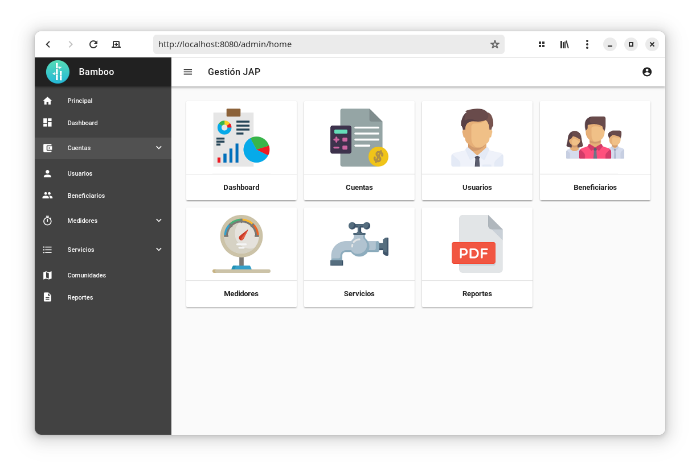
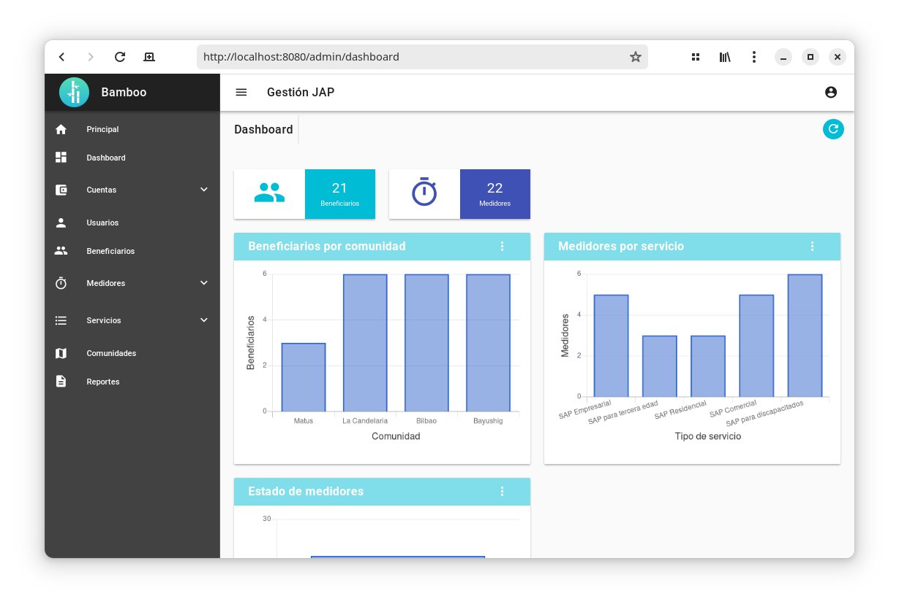

# Bamboo

Bamboo es un sistema para la automatización de las tarifas de servicio de agua potable.

<div style="display: flex;">
    <div style="flex: 50%;">
       
    </div>
    <div style="flex: 50%;">
       
    </div>
</div>


## Dependencias

Este proyecto se divide en backend y frontend, por lo que debe tener los entornos para ambos módulos.

Dependencias para el **backend**.
* Java
* Maven
* Postgresql

Dependencias para el **frontend** 
* Node.js
* npm

## Base de datos
Bamboo usa postgresql como DBMS. Para montar la base de datos existen los respectivos scripts en el directorio **/sql**.

Acceder al directorio de los scripts
```
cd sql
```

Una vez accedido al directorio `sql` creamos la base de datos.
``` shell
createdb -U postgres bamboo
```

Ahora que hemos establecido la base de datos, el siguiente paso es ejecutar los scripts de inicio junto con el usuario `admin` con la contraseña `admin`.
```shell
psql -U postgres -d bamboo -f 1.-Tables.sql -f 2.-Relations.sql -f 3.-Values.sql -f 4.-Triggers.sql -f 5.-Views.sql
```
Si es necesario agregar datos ficticios, ejecutaremos la siguiente instrucción.
```shell
psql -U postgres -d bamboo -f TestValues.sql
```


Para el acceso a la base de datos del backend se lo debe configurar en el archivo *src/main/java/com/bamboo/connection/DBConnection.java*.

```java
    final String DRIVER = "org.postgresql.Driver";
    final String URL = "jdbc:postgresql://localhost:5432/bamboo";
    final String USER = "postgres";
    final String PASSWORD = "postgres";
```
## Backend

Entra al directorio del proyecto y ejecuta la instalación de las dependencias requeridas.
```
mvn dependency:resolve
```

## Frontend


Acceder al directorio del frontend.
``` shell
cd front
```
Instalar las dependencias.
```shell 
npm  install
```

## Compilación

Bamboo al estar separado por backend y frontend se los debe compilar por separado.


1. **Frontend**

Acceder al frontend
```shell 
cd front
```
Compilar el frontend.
```shell 
yarn  build
```
<span style="color:grey">NOTA: se debe compilar primero el frontend para que se agrege al servidor.</span>
1. **Backend**

Acceder al directorio de bamboo.
Acceder al frontend
```shell 
cd directorio
```

Compilar el backend.
```shell 
mvn clean install
```
El backend genera un archivo con la extención *.war* en el directorio *target*.

<span style="color:grey">NOTA: se debe tener la conexión a la base de datos abierta para la compilación.</span>


## Despliege
Para la implementación en tomcat 9, el usuario debe estar configurado en *tomcat9/config/tomcat-users.xml*.
```xml 
<user password="secret_password" username="user" roles="manager-script,admin, manager-gui" />
```

[!NOTE]
Si la ruta es la raiz, el archivo *.war* no debe tener nombre, solo se debe llamar *.war*.